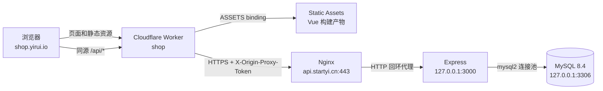

# 当前系统架构

> 状态快照：2026-09-14。本文描述已经部署的 Phase 0–10 实现；历史目标和实施阶段见 [初始部署计划](history/initial-deployment-plan.md)。

## 总览

拾页是前后端分层的单仓库应用。浏览器只访问 `shop.yirui.io`：非 API 请求由 Cloudflare Static Assets 返回 Vue SPA，`/api/*` 由同一个 Worker 转发到固定源站。业务逻辑只存在于 Express 和 MySQL，不存在于 Worker。



生产请求链路是：

```text
shop.yirui.io
→ Cloudflare Worker shop
→ api.startyi.cn
→ Nginx :443
→ Express 127.0.0.1:3000
→ MySQL 127.0.0.1:3306
```

## 组件与版本

| 层 | 当前实现 | 版本或关键配置 |
| --- | --- | --- |
| 前端 | Vue + Vue Router + JavaScript | Vue 3.5.42、Vue Router 4.6.4 |
| 构建 | Vite | 7.3.6，输出 `dist/` |
| 边缘 | Cloudflare Worker + Static Assets | Worker `shop`，Wrangler 4.131.2，compatibility date `2026-09-14` |
| 后端 | Node.js + Express | 生产 Node.js 24.21.0、Express 5.2.1 |
| 数据库访问 | `mysql2/promise` | mysql2 3.24.4，连接池上限 10 |
| 数据库 | MySQL Community Server | 8.4.11，InnoDB、`utf8mb4_0900_ai_ci` |
| 源站入口 | Nginx | 1.24.0，TLS 终止及 API 反向代理 |
| 进程管理 | systemd | `ecommerce.service`，以 `agent:agent` 运行 |

版本来自 lockfile、生产运行时和生产命令核验；升级后应同步更新本表。

## 各层职责

### Cloudflare Worker

[`worker/index.js`](../worker/index.js) 只有两类行为：

1. 非 API 请求交给 `ASSETS` binding；Static Assets 使用 SPA fallback。
2. `/api` 与 `/api/*` 固定代理到 `https://api.startyi.cn`，保留 path、query、method、body、Cookie 等请求信息，并覆盖写入 `X-Origin-Proxy-Token`。

Worker 不连接数据库，不验证用户 Session，不计算价格或库存，也不处理购物车、订单或支付。`API_ORIGIN` 必须与代码内固定源站一致，客户端不能把 Worker 变成任意目标代理。

### Vue 前端

[`src/main.js`](../src/main.js) 使用 `createWebHistory()`，是一个 SPA。当前页面路由为：

| 路由 | 页面 |
| --- | --- |
| `/` | 商品列表、分类、搜索和排序 |
| `/cart` | 游客或登录用户购物车 |
| `/login` | 登录 |
| `/register` | 注册 |
| `/orders` | 当前用户订单列表 |
| `/orders/:id` | 当前用户订单详情 |

未知前端路由重定向至 `/`。Cloudflare Static Assets 的 `not_found_handling: single-page-application` 支持 History 路由直接刷新。

前端所有服务器请求均使用相对路径 `/api/...` 和 `credentials: 'same-origin'`，没有生产 API Base URL，也没有 CORS 依赖。本地开发由 [`vite.config.js`](../vite.config.js) 把 `/api` 代理至 `http://127.0.0.1:3000`。

### Express 后端

[`backend/src/server.js`](../backend/src/server.js) 创建 MySQL 连接池和业务服务；[`backend/src/app.js`](../backend/src/app.js) 按顺序安装源站代理校验、JSON 解析、Session 解析和路由。生产配置强制 `HOST=127.0.0.1`。

当前 API：

| 方法 | 路径 | 认证 | 作用 |
| --- | --- | --- | --- |
| GET | `/api/categories` | 否 | 查询分类 |
| GET | `/api/products` | 否 | 查询全部可售商品 |
| GET | `/api/products/:id` | 否 | 查询单件可售商品 |
| POST | `/api/auth/register` | 否 | 注册并创建 Session |
| POST | `/api/auth/login` | 否 | 登录并创建 Session |
| POST | `/api/auth/logout` | 可选 | 撤销当前 Session 并删除 Cookie |
| GET | `/api/auth/me` | 是 | 查询当前用户 |
| GET | `/api/cart` | 是 | 查询登录用户购物车 |
| PUT | `/api/cart/items/:productId` | 是 | 设置商品数量（1–99） |
| DELETE | `/api/cart/items/:productId` | 是 | 移除购物车商品 |
| POST | `/api/orders` | 是 | 从当前购物车创建订单 |
| GET | `/api/orders` | 是 | 查询当前用户订单 |
| GET | `/api/orders/:id` | 是 | 查询当前用户拥有的订单 |

API 错误使用有限的 JSON 错误码；未预期错误不会向客户端返回内部异常细节。

### Nginx、systemd 与 MySQL

- Nginx 仅为 `api.startyi.cn` 的 `/api/` 代理到 Express；HTTP 80 跳转 HTTPS，其他 HTTPS 路径返回 404。
- `ecommerce.service` 从 `/etc/ecommerce/backend.env` 读取生产变量，以 `agent` 运行 `/srv/ecommerce/runtime/current/bin/node src/server.js`。
- MySQL 保存业务数据并负责约束、关系、事务和并发库存控制。详细结构见 [数据库文档](database.md)。

## 数据归属

| 数据 | 唯一业务数据源 | 说明 |
| --- | --- | --- |
| 商品名称、描述、分类、价格、库存、可售状态 | MySQL | 前端通过 `/api/products` 和 `/api/categories` 读取 |
| 用户、密码哈希、Session 哈希 | MySQL | 明文密码和明文 Session Token 不入库 |
| 登录用户购物车 | MySQL | 按用户持久化 |
| 游客购物车商品 ID 与数量 | 浏览器 `localStorage` | key 为 `shiye-cart-v1`，不跨浏览器同步 |
| 订单、订单项、下单价格快照 | MySQL | 订单查询按用户归属过滤 |
| 商品插画类型、颜色、徽标、显示顺序 | [`src/data/products.js`](../src/data/products.js) | 仅为稳定商品 ID 对应的 presentation mapping，不是业务数据源 |

## 仓库结构

```text
e-commerce/
├─ src/                    Vue SPA、页面、composables 和展示映射
├─ worker/                 Cloudflare Worker 入口
├─ backend/
│  ├─ src/                 Express、路由、中间件和业务服务
│  ├─ test/                不依赖真实数据库的后端测试
│  ├─ integration/         真实 MySQL 集成测试
│  └─ scripts/             本地数据库初始化脚本
├─ database/               MySQL schema 与固定 seed
├─ deploy/                 systemd、Nginx 和 release 安装脚本
├─ tests/                  前端、Worker 与浏览器测试
├─ docs/                   当前文档与历史记录
├─ vite.config.js          本地开发代理
└─ wrangler.jsonc          Worker 和 Static Assets 配置
```

## 当前范围外能力

当前没有真实支付、退款、物流、密码找回、邮箱验证或后台管理系统。新订单状态固定为 `placed`；这些缺失项不能在文档或界面中描述为已实现。

[返回项目入口](../README.md) · [部署](deployment.md) · [数据库](database.md) · [安全](security.md)
