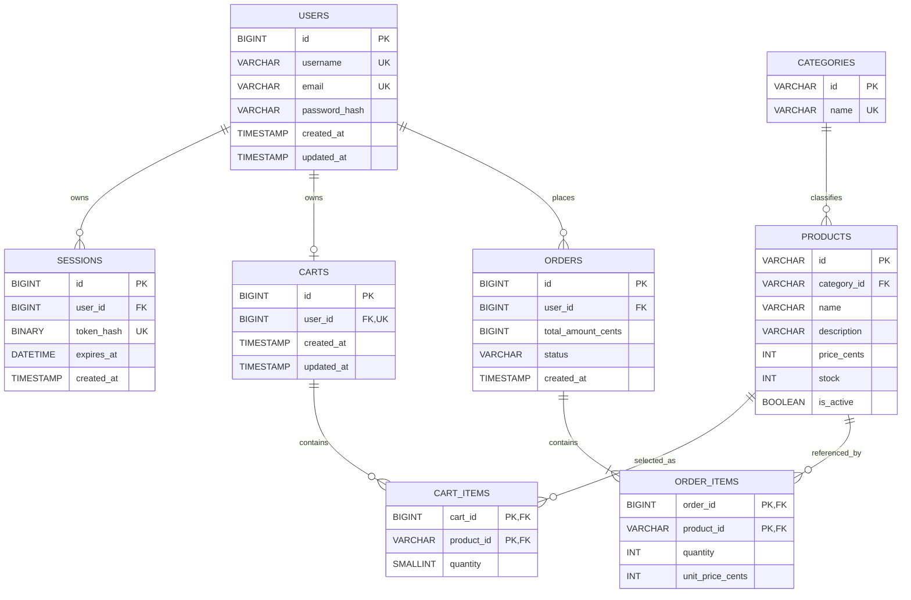

# 数据库设计与事务

> 当前实现：MySQL Community Server 8.4.11，数据库 `ecommerce`，表引擎 InnoDB，字符集 `utf8mb4`，排序规则 `utf8mb4_0900_ai_ci`。权威定义是 [`database/schema.sql`](../database/schema.sql)。

## 表关系



## 数据表

| 表 | 作用 | 关键约束与索引 |
| --- | --- | --- |
| `users` | 账户 | 用户名、邮箱唯一；保存 Argon2id `password_hash` |
| `sessions` | 服务端登录会话 | `token_hash` 唯一；索引 `user_id`、`expires_at`；用户删除时级联删除 |
| `categories` | 商品分类 | 稳定字符串主键，分类名唯一 |
| `products` | 商品业务数据 | 分类外键；库存和价格非负；`(category_id, is_active)`、`(is_active, name)` 索引 |
| `carts` | 每个登录用户的购物车容器 | `user_id` 唯一；用户删除时级联删除 |
| `cart_items` | 购物车商品和数量 | `(cart_id, product_id)` 复合主键；数量 1–99；购物车删除时级联删除 |
| `orders` | 订单主表 | 用户与创建时间、状态与创建时间索引；状态初始为 `placed` |
| `order_items` | 订单明细 | `(order_id, product_id)` 复合主键；保存数量和 `unit_price_cents` 价格快照 |

商品、购物车和订单表通过外键保持引用完整性。订单及订单项不会在用户或商品删除时级联消失：相关外键使用 `ON DELETE RESTRICT`，避免静默破坏历史记录。

## 数据所有权

MySQL 是以下业务字段的唯一数据源：

- 分类 ID 与名称；
- 商品 ID、分类、名称、描述、价格、库存和可售状态；
- 用户和密码哈希；
- Session Token 哈希及过期时间；
- 登录用户购物车；
- 订单、订单项、状态、总额和下单价格快照。

[`src/data/products.js`](../src/data/products.js) 只按稳定商品 ID 映射插画、颜色、徽标和前端显示顺序。它不得重新加入价格、库存、名称、描述或分类等业务真值。游客购物车例外地只在浏览器 `localStorage` 保存 `{ productId, quantity }`。

## 下单事务

实现位于 [`backend/src/services/orders.js`](../backend/src/services/orders.js)。一次 `POST /api/orders` 使用同一 MySQL connection 执行：

1. `BEGIN`。
2. 按 `user_id` 查询购物车并 `FOR UPDATE` 锁定购物车行；不存在则失败。
3. 按 `product_id` 排序读取购物车项并连接商品表，使用 `FOR UPDATE` 锁定涉及的行。
4. 校验购物车非空、商品存在、商品可售且库存足够。
5. 使用事务内读取的 `price_cents × quantity` 计算订单总额。
6. 插入 `orders`，第一版状态固定为 `placed`。
7. 插入每条 `order_items`，把当时的 `price_cents` 写入 `unit_price_cents`。
8. 使用 `UPDATE products SET stock = stock - ? WHERE ... AND stock >= ?` 扣减库存，并要求每次更新恰好影响一行。
9. 删除当前购物车项并更新购物车时间。
10. 读取刚创建的订单并 `COMMIT`。

任意查询、校验或写入失败都会执行 `ROLLBACK`，最终释放 connection。失败事务不会留下半成品订单、订单项、错误库存，也不会清空购物车。

### 并发安全

- 事务先锁购物车行，再按稳定的 `product_id` 顺序锁定商品相关行，串行化针对同一库存的竞争，并降低不同下单事务锁顺序不一致的风险。
- 库存更新再次使用 `stock >= quantity` 条件，且检查 `affectedRows === 1`，作为锁之外的最终保护。
- `stock` 使用无符号列并带非负检查约束；数据库层不允许负库存。
- 真实 MySQL 并发集成测试覆盖两个事务竞争低库存的情形，断言至多一个成功、库存不小于 0，失败事务不残留订单或订单项。

### 价格快照的边界

历史订单金额使用 `orders.total_amount_cents` 和 `order_items.unit_price_cents`，后续修改 `products.price_cents` 不会改变历史金额。当前 `order_items` 不保存商品名称或描述快照；订单查询会连接当前 `products` 表读取名称和描述，这一点不要误写成完整商品快照。

### 订单归属

订单列表和详情查询都把认证用户 ID 作为条件。详情查询同时约束 `o.user_id = ?` 和 `o.id = ?`；用户不能读取其他用户的订单，非法 ID 和非本人订单统一表现为未找到。

## Session 数据

Session 明文 Token 由服务端以 32 字节随机数生成，只通过 Host-only Cookie 交给浏览器。数据库只存储 SHA-256 后的固定 32 字节 `token_hash`。查询要求 `expires_at > UTC_TIMESTAMP(6)`；创建新 Session 时会清理已过期行，退出时按 Token 哈希删除当前 Session。

## Schema 与 seed

- [`database/schema.sql`](../database/schema.sql) 使用 `CREATE DATABASE/TABLE IF NOT EXISTS` 建立当前结构。
- [`database/seed.sql`](../database/seed.sql) 固定写入 4 个分类和 12 件商品；初始库存值只生成过一次，SQL 中没有 `RAND()`。
- seed 重复执行时会更新分类以及商品的分类、名称、描述、价格和可售状态，但故意不覆盖现有 `stock`，因为初始化后库存由数据库和下单事务维护。
- 当前仓库没有版本化 migration 框架或 migration 目录。`schema.sql` 与 `seed.sql` 是初始化入口，不应被误认为完整的生产迁移历史。

## 初始化与权限

本地开发使用：

```sh
npm --prefix backend run db:setup
```

[`backend/scripts/setup-database.js`](../backend/scripts/setup-database.js) 默认通过 MySQL login-path `ecommerce-setup` 执行 schema、seed，并创建或更新 `ecommerce_app@localhost`。管理员密码由 `mysql_config_editor` 管理，不写入项目。

生产应用同样使用 `ecommerce_app@localhost`，当前授权范围只有：

```text
SELECT, INSERT, UPDATE, DELETE ON ecommerce.*
```

应用账户没有 DDL、GRANT 或全局管理权限。生产建库、结构变化、账户管理和数据恢复属于管理员操作，不应让 Express 使用 root 凭据。

## 验证命令

```sh
npm --prefix backend test
npm --prefix backend run test:db
npm run test:live
```

`test:db` 和 `test:live` 会连接真实的本地开发数据库并创建测试数据，不应直接指向生产数据库执行。

[返回项目入口](../README.md) · [架构](architecture.md) · [部署](deployment.md) · [运维](operations.md)
